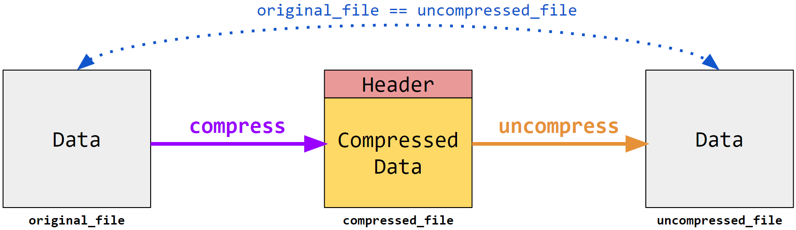

In the age of big data, there is a constant struggle with regard to storage. For example, a single Whole Genome Sequencing experiment can generate over 100 GB of raw data. For years, computer scientists have attempted to reduce the storage size of files without losing any information. In this assignment, we will be implementing our own file compression tool using the Huffman algorithm.

# Task: File Compression and Uncompression
In this project, "all" you have to do is implement two programs: **`compress`** and **`uncompress`**. The usage should be as follows:

```bash
$ ./compress <original_file> <compressed_file>
$ ./uncompress <compressed_file> <uncompressed_file>
```

For grading purposes, you are guaranteed that `original_file` will be at most 10 MB.



## *File Compression*
The `compress` program will take as input an arbitrary file (`original_file`) and will use Huffman Compression to create a compressed version of the file (`compressed_file`):

1. Construct a Huffman code for the contents of `original_file`
2. Use the constructed Huffman code to encode `original_file`
3. Write the results (with a header to allow for uncompression) to `compressed_file`

## *File Uncompression*
The `uncompress` program will then take as input a compressed file created by your `compress` program (`compressed_file`) and will uncompress the file (`uncompressed_file`):

1. Construct a Huffman code by reading the header of `compressed_file`
2. Use the constructed Huffman code to decode `compressed_file`
3. Write the results to `uncompressed_file`

Note that `uncompressed_file` must be **completely identical** to `original_file`! In other words, calling `diff` should return no differences:

```bash
$ diff uncompressed_file original_file # this should not output anything
```

## *Reference Solution*
You have been provided two programs (`refcompress` and `refuncompress`), which are a reference solution implementation of this Project. You can use them to help guide you. Note that the reference binaries were compiled to run in *this Project's* coding environment, so if you attempt to run them on a different architecture, they will most likely not work.

**Note:** Your `compress` is **not** expected to work with `refuncompress`, and your `uncompress` is **not** expected to work with `refcompress`. The provided reference executable files are a matched pair.

# Compiling and Running
We have provided a `Makefile`, but **you are free to modify *anything* in the starter code** that you'd like (including the `Makefile` and any of the `.cpp` or `.hpp` files) however you wish, and you are allowed to use anything in the C++ STL. Our only requirements are the following:

1. We need to be able to compile your code using the `make` command
2. Once compiled, we need to be able to run your `compress` and `uncompress` programs as described above

# Submitting
Once you are ready to submit your code, click the **"Save & Grade"** button at the bottom-left corner of this panel. Your code **will not** submit automatically: you **must** submit your code by clicking this button before the deadline, otherwise your code **will not be accepted**.
