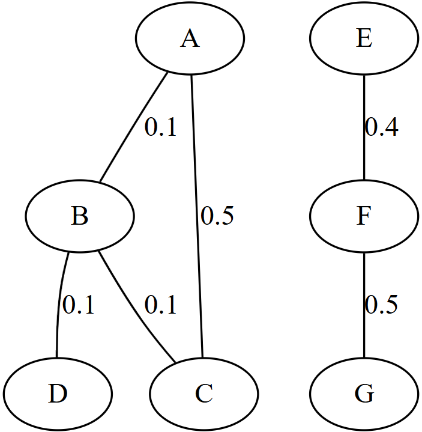

The mathematical concept of a "graph" is fundamental to Computer Science. In general, any network of connected individuals can be represented using a graph. Almost *all* of the data structures covered in this course are either themselves graphs or can be abstractly represented using a graph.

For example, in the realm of [HIV](https://doi.org/10.1093/infdis/jiy431) and [COVID-19](https://virological.org/t/methods-for-molecular-transmission-cluster-detection/934/2) epidemiology, the current gold-standard method for analyzing viral sequence data to study the spread of the virus is to perform [transmission clustering](https://www.cdc.gov/hiv/programresources/guidance/cluster-outbreak/index.html) using a tool called [HIV-TRACE](https://github.com/veg/hivtrace) ([Pond *et al*., 2018](https://doi.org/10.1093/molbev/msy016)). If you are given *n* viral sequences (one collected per patient), HIV-TRACE essentially does the following:
* Construct an empty graph with *n* nodes (one per sequence)
* Compute the distance between each pair of sequences (*u*,*v*) under the [TN93](https://github.com/veg/tn93) model of DNA evolution ([Tamura & Nei, 1993](https://doi.org/10.1093/oxfordjournals.molbev.a040023))
* If the pairwise distance between *u* and *v* is less than or equal to a given threshold (HIV-TRACE uses [0.015](https://github.com/veg/hivtrace#example-usage) by default), connect *u* and *v* with an undirected edge
* Each of the connected components of the resulting graph define a "transmission cluster"
* In addition to finding transmission clusters, the graph produced by HIV-TRACE can yield other information relevant for the prevention of the spread of a virus ([Grabowski *et al*., 2018](https://doi.org/10.1007/s11904-018-0384-1))

In this Project, we have provided an API of a `Graph` class that you need to implement. This class will be used to represent undirected graphs. In the starter code, we have provided 4 code files (`Graph.h`, `Graph.cpp`, `GraphTest.cpp`, and `Makefile`) as well as 2 example graph files (`small.csv` and `hiv.csv`).

# `Graph.h`
This file contains the basic declarations of the (undirected) `Graph` class that you need to implement. We have declared a series of function signatures that you will need to implement. You are free to modify `Graph.h` however you wish (e.g. adding instance variables to the `Graph` class, adding any helper functions you'd like, etc.). Our only requirement is that the function signatures we have declared remain unchanged (though you are welcome to overload them if you wish).

Please be sure to **thoroughly read the header comments** in `Graph.h` to be sure you understand the functionality, input(s), and output(s) of each function in the `Graph` class.

# `Graph.cpp`
This file contains the skeleton of implementing the functions we have declared in the (undirected) `Graph` class. Your task is to fill in the function bodies. You are welcome to add any variables, functions, classes, etc. you wish, and you are allowed to use anything in the C++ STL.

# `GraphTest.cpp`
This file contains a tester program to help you run and test your code. We will be using this program to grade your code. You are welcome to modify `GraphTest.cpp` for testing purposes however you wish: we will simply ignore any changes you have made to `GraphTest.cpp` when we grade your code. The `GraphTest` executable that is created from `GraphTest.cpp` can be run as follows:

```bash
$ ./GraphTest <edgelist_csv> <test>
```

## *Edge List*
The `<edgelist_csv>` argument is the filename of an [edge list](https://en.wikipedia.org/wiki/Edge_list) representing an undirected graph with non-negative edge weights in the CSV format: each line represents an undirected edge between nodes `u` and `v` with weight `w` in the following format: `u,v,w`

For example, imagine we want to represent the following graph:



We could represent it using the following edge list CSV (note that the order of the rows is arbitrary):

```
A,B,0.1
A,C,0.5
B,C,0.1
B,D,0.1
E,F,0.4
F,G,0.5
```

In the `example` folder of the starter code, we have provided 2 example edge list CSV files: `small.csv`, which is the exact graph shown above, and `hiv.csv`, which is a small example graph produced from an HIV-TRACE analysis of a real HIV dataset from San Diego ([Little *et al*., 2014](https://doi.org/10.1371/journal.pone.0098443)).

Here are some things you can expect about the edge list CSVs you will be given:
* You are guaranteed that edge weights will be non-negative (i.e., they will be ≥0)
* You are guaranteed there will not be any self-edges (e.g. `u,u,?`)
* You are guaranteed that you will *not* be given a [*multigraph*](https://en.wikipedia.org/wiki/Multigraph), meaning you are guaranteed that there will not exist multiple edges between nodes *u* and *v* in the provided edge list
* Further, because the edges are undirected, if you see an edge from *u* to *v* (e.g. `u,v,?`), you are guaranteed that you will *not* see an edge from *v* to *u* (e.g. `v,u,?`) later in the file
    * Remember: an edge from *u* to *v* is bidirectional and is thus *also* an edge from *v* to *u*
* You are guaranteed that there will be at least 1 edge in the graph
* You are *not* guaranteed that the edges in the CSV will be sorted in any particular order

## *Test*
The `<test>` argument denotes which of the `GraphTest` tests you want to run. The tests are as follows:
* `graph_properties`: Test building a `Graph` object and checking its basic properties
* `shortest_unweighted`: Test the `Graph::shortest_path_unweighted` function
* `shortest_weighted`: Test the `Graph::shortest_path_weighted` function
* `connected_components`: Test the `Graph::connected_components` function
* `smallest_threshold`: Test the `Graph::smallest_connecting_threshold` function

Feel free to investigate the code within `GraphTest.cpp` to see how exactly it works.

# `Makefile`
This file will help you compile your code using the `make` command. If you choose to create any additional code files, you are welcome to do so: our only requirement is that, given the original version of `GraphTest.cpp`, we should be able to run your code using the `make` command, which should create an executable called `GraphTest` that can be run as described above.

# Submitting
Once you are ready to submit your code, click the **"Save & Grade"** button. Your code **will not** submit automatically: you **must** submit your code by clicking this button before the deadline, otherwise your code **will not be accepted**.
