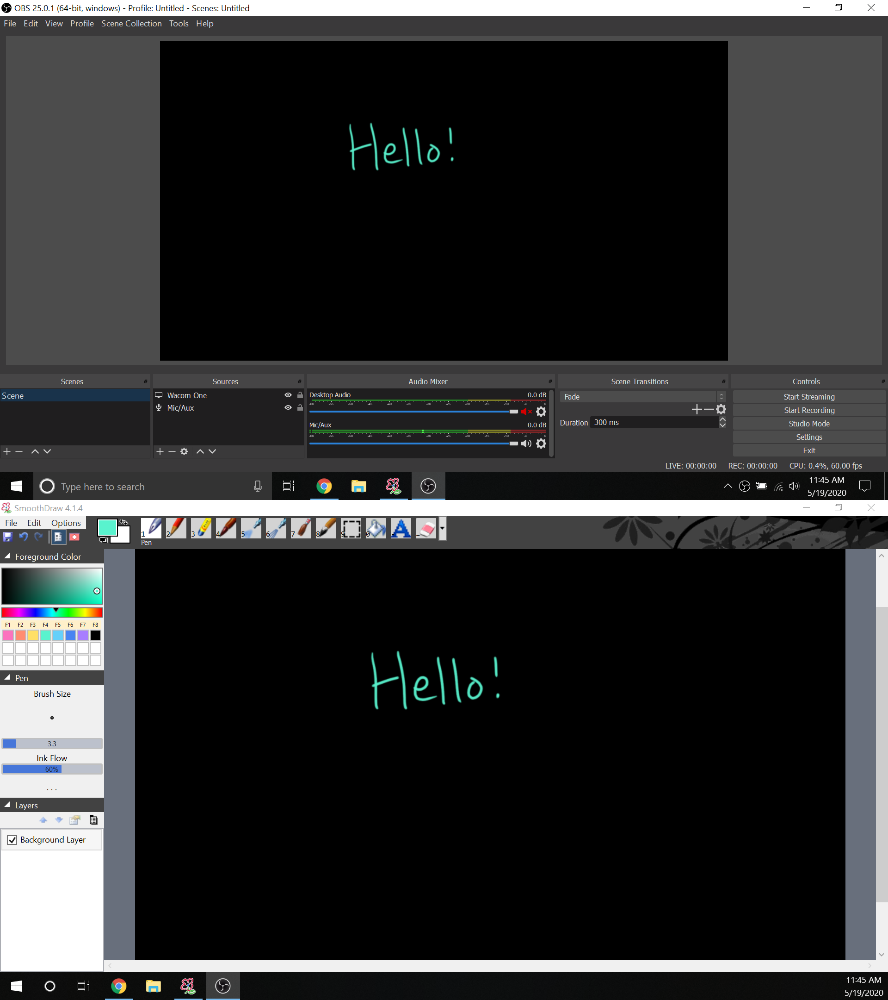

# Recording Khan Academy Style Videos
I find it useful to record short topic videos in the Khan Academy style of video production (see [Advanced Data Structures](https://www.youtube.com/playlist?list=PLM_KIlU0WoXmkV4QB1Dg8PtJaHTdWHwRS) for examples). In this tutorial, I will briefly describe my setup.

## Hardware: Wacom One Pen Display
In my videos, I draw and write things as I talk. To help me draw more smoothly/clearly/legibly, I use a [Wacom One pen display](https://www.wacom.com/en-us/products/pen-displays/wacom-one), which is a tablet + screen. This is useful because, unlike the Wacom tablets that are not also screens, my pen is directly on top of what I am drawing.

Note that I purchased a Wacom One pen display because my laptop does not have a touchscreen and because I don't own an Android/iPad tablet. If you already own a device that has a touchscreen with which you can use a pen, that would work as well.

## Hardware: Microphone
In my videos, I unfortunately am using the microphone built into my headset, and the audio doesn't sound the best. It may be worth investing in a decent microphone. People have recommended the [Blue Snowball](https://www.bluedesigns.com/products/snowball/) and the [Samson Meteor](http://www.samsontech.com/samson/products/microphones/usb-microphones/meteormic/) as good microphones that are decently-priced.

## Software
Note that every piece of software I use is free.

### Drawing
I use [SmoothDraw](http://www.smoothdraw.com/sd) to actually do the drawing. It is similar in function to Microsoft Paint, but it integrates more nicely with tablets/pens, and the drawing looks more smooth. It seems as though this is what Khan Academy uses.

In SmoothDraw, I use the color palette [recommended by Khan Academy](https://khanacademy.zendesk.com/hc/en-us/articles/226885367-How-do-I-recreate-Khan-Academy-videos-). The following color palette is for a black background (which is how I record all my videos):

|   Color    |     Code    |
| :--------: | :---------: |
| White      | ``#FFFFFF`` |
| Pink       | ``#FB73BE`` |
| Coral      | ``#FF8D71`` |
| Yellow     | ``#FFE066`` |
| Teal       | ``#59F3CE`` |
| Light Blue | ``#65D0FA`` |
| Blue       | ``#4984F2`` |
| Purple     | ``#A87DFF`` |

The following color palette is for a white background:

|   Color   |     Code    |
| :-------: | :---------: |
| Off Black | ``#21242C`` |
| Gray      | ``#717378`` |
| Red       | ``#D92916`` |
| Blue      | ``#1865F2`` |
| Purple    | ``#8A4FFF`` |

For convenience during recording, I have these colors saved in my SmoothDraw color palette.

### Recording
To actually record the videos, I use [Open Broadcaster Software (OBS)](http://obsproject.com/). I open SmoothDraw on my tablet screen, and in OBS, I set a video source to be a window that is contained within the drawing area of SmoothDraw. I believe I used [this Reddit post](https://www.reddit.com/r/obs/comments/550rp8/how_to_record_a_certain_part_of_screen/) (or similar) to figure out how to select a specific part of the screen in OBS (in my case, only the drawing area of SmoothDraw). The result looks as follows:

### Editing
To edit the recorded videos, I use the free version of [DaVinci Resolve](https://www.blackmagicdesign.com/products/davinciresolve/). I mainly use it to do the following tasks:

* I give myself pauses at the beginning and end of videos as well as in the middle if I need to collect my thoughts, so I use Resolve to cut out these pauses
* Sometimes, if I'm drawing something without talking, I will speed up the drawing portion to 2x speed to make the video a bit shorter and avoid awkwardly long silence
* I try to record each individual component of a "full video" as a separate recording, so I use Resolve to concatenate the individual pieces of a "full video" together
    * Note that I aim to have the complete "full videos" to be between 5 and 15 minutes in length (usually around 10): I try to have them be short, self-contained videos about a specific idea
    * Each of these shorter "components" is usually 2-3 minutes long
* I export my videos as MP4 files with the H264 codec at 1080p resolution
